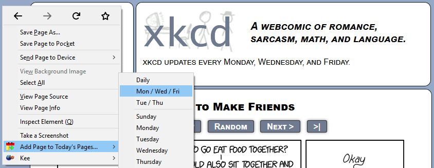

# Today's Pages

Opens the websites you want to see today.

[Install Today's Pages in Firefox](https://addons.mozilla.org/en-US/firefox/addon/todays-pages/)

## How to use

### To add sites:
1. Right-click on a page, tab, or the add-on button.
1. Under "Add Page to Today's Pages", click the day you want to add the page to.

### To open sites:
1. Click the add-on button. All the sites that have been added for today will open in new tabs.

### To manage sites:

Today's Pages adds pages to your bookmarks.
1. To open up the bookmarks manager in Firefox, press Ctrl-Shift-B or click on "Show All Bookmarks" in the bookmarks menu.
1. Navigate to All Bookmarks > Other Bookmarks > Today's Pages
1. Underneath Today's Pages, there are 7 folders, one for each day of the week. You can modify the bookmarks here to control which sites open on a particular day, and the order in which they open.
